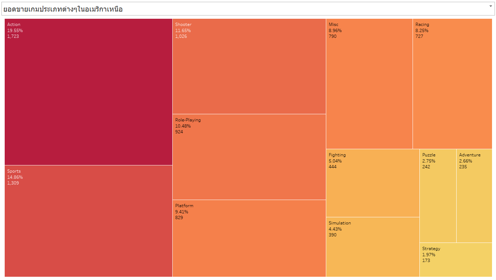

## คำนำ

เอกสารฉบับนี้จัดทำขึ้นเพื่อแสดงผลการวิเคราะห์ข้อมูลยอดขายวิดีโอเกมจากแหล่งข้อมูล Kaggle โดยใช้เครื่องมือ **Tableau** ในการสร้าง Dashboard เพื่อถ่ายทอดข้อมูลเชิงลึกในรูปแบบที่เข้าใจง่าย เหมาะสำหรับนักวิเคราะห์ข้อมูล นักพัฒนาเกม และผู้ที่สนใจในอุตสาหกรรมเกม

การวิเคราะห์ครอบคลุมแนวโน้มยอดขายตามช่วงเวลา แพลตฟอร์ม ประเภทเกม และความแตกต่างตามภูมิภาค ได้แก่ อเมริกาเหนือ (NA), ยุโรป (EU) และญี่ปุ่น (JP) โดยมีการตั้งคำถามเพื่อเจาะลึกข้อมูลในมิติต่าง ๆ พร้อมข้อเสนอแนะเชิงกลยุทธ์ที่อิงจากข้อมูลจริง

เอกสารนี้หวังว่าจะเป็นแนวทางสำหรับการตัดสินใจด้านการตลาด การพัฒนาเกม และการเข้าใจพฤติกรรมผู้บริโภคในแต่ละภูมิภาคได้ดียิ่งขึ้น

---

## สารบัญ

1. [ภาพรวมโปรเจกต์](#video-game-sales-analysis-dashboard)  
2. [Tableau Dashboard Overview](#tableau-dashboard-overview)  
3. [รายละเอียดใน Dashboard](#รายละเอียดใน-dashboard)  
   - แนวโน้มยอดขายตามเวลา  
   - ยอดขายตามแพลตฟอร์ม  
   - ยอดขายตามภูมิภาค  
   - ยอดขายตามประเภทเกมและแพลตฟอร์ม  
   - Top 10 เกมยอดขายสูงสุด (ตามภูมิภาค)  
4. [Dataset](#dataset)  
5. [Tools Used](#tools-used)  
6. [In-Depth Analysis](#in-depth-analysis)  
   - คำถามที่ 1: Platform ไหนขายดีในแต่ละช่วงปี?  
   - คำถามที่ 2: ประเภทเกมใดทำกำไรสูงในแต่ละภูมิภาค?  
   - คำถามที่ 3: ภูมิภาคใดมีแนวโน้มยอดขายเติบโตหรือลดลง?  
   - คำถามที่ 4: ยอดขายขึ้นอยู่กับ Platform และปีวางจำหน่ายหรือไม่?  
   - คำถามที่ 5: ยอดขายรวมลดลงหลังปี 2010 จริงไหม?  
   - คำถามที่ 6: เกมใดประสบความสำเร็จในแต่ละภูมิภาค?  
7. [Insights & Recommendations](#insights--recommendations)
8. [Conclusion](#Conclusion) 
9. [ลิงก์ Tableau Dashboard](#ลิงก์-tableau-dashboard)
#  Video Game Sales Analysis Dashboard

โปรเจกต์นี้วิเคราะห์ข้อมูลยอดขายวิดีโอเกมจาก Kaggle โดยใช้ **Tableau** เพื่อแสดงภาพรวมแนวโน้มยอดขายตามปี แยกตามแพลตฟอร์ม ประเภทเกม และภูมิภาคต่างๆ (NA, EU, JP)

---

##  Tableau Dashboard Overview

---

##  รายละเอียดใน Dashboard

### 1. แนวโน้มยอดขายตามเวลา (Global Sales by Year)
- **ประเภทกราฟ**: Line Chart  
- **Insight**: ยอดขายพุ่งสูงสุดช่วงปี 2006–2010 และลดลงหลังจากนั้น

---

### 2. ยอดขายตามแพลตฟอร์ม (Platform over Time)
- **ประเภทกราฟ**: Multi-line Chart  
- **Insight**: PS2, Wii, และ DS มียอดขายสูงในยุค 2000s, Xbox 360 และ PS3 ตามมา

---

### 3. ยอดขายตามภูมิภาค
- **ประเภทกราฟ**: Treemap (แยกตาม NA, EU, JP)  
- **Insight**:
  - NA ชอบเกมแนว Action และ Shooter  
  - JP นิยม RPG  
  - EU มียอดขายใกล้เคียง NA แต่หลากหลายกว่า

---

### 4. ยอดขายตามประเภทเกมและ Platform
- **ประเภทกราฟ**: Horizontal Bar Chart  
- **Field ที่ใช้**: `Genre + Platform` (Combined Field)  
- **Insight**: Action-PS2 และ Sports-Wii ทำยอดขายสูงสุด

---

### 5. Top 10 เกมยอดขายสูงสุด (แยกตามภูมิภาค)
- **ประเภทกราฟ**: Bar Chart  
- **Insight**:  
  - NA: Need for Speed, LEGO, FIFA ขายดี  
  - JP: ซีรีส์ Final Fantasy และ Pokémon ครองอันดับต้นๆ  
  - EU: FIFA ครองอันดับท็อปต่อเนื่องหลายเวอร์ชัน

---

##  Dataset

- [Kaggle: Video Game Sales Dataset](https://www.kaggle.com/datasets/gregorut/videogamesales)

---

##  Tools Used

- Tableau (Data Visualization)  
- Python (Data Cleaning)  
- GitHub (Project Hosting)

---

##  In-Depth Analysis

###  คำถามที่ 1: Platform ไหนขายดีในแต่ละช่วงปี?

  

“จากกราฟยอดขายตามแพลตฟอร์ม เราพบว่า PS2 และ Wii เป็นแพลตฟอร์มที่มียอดขายสูงมากช่วงปี 2005–2010 จากนั้นถูกแทนที่ด้วย X360 และ PS3 หลังปี 2010 ซึ่งสะท้อนถึงการเปลี่ยนผ่านของตลาดเกมทุก 5–7 ปี ในขณะเดียวกัน กราฟเส้นแนวโน้มยอดขายรวมก็แสดงให้เห็นว่า ช่วงปี 2008–2010 เป็นจุดพีคของอุตสาหกรรม ก่อนที่ยอดขายจะลดลงต่อเนื่องจนถึงปัจจุบัน”

---

###  คำถามที่ 2: ประเภทเกมใดทำกำไรสูงในแต่ละภูมิภาค?

  
  

“จาก Tree Map แต่ละภูมิภาคจะเห็นว่า  
อเมริกาเหนือ (NA): เกมแนว Action และ Shooter มียอดขายรวมมากที่สุด  
ยุโรป (EU): ยังคงนิยมแนว Action, Sports และ Racing  
ญี่ปุ่น (JP): เกมแนว Role-Playing (RPG) ครองตลาดอย่างชัดเจน โดยมียอดขายสูงสุดในหมวดนี้ สิ่งนี้สะท้อนถึง ‘ความชอบที่แตกต่างกันของผู้เล่นในแต่ละภูมิภาค’ ซึ่งเป็นข้อมูลสำคัญในการกำหนดแนวเกมให้เหมาะกับตลาดเป้าหมาย”  

---

###  คำถามที่ 3: ภูมิภาคใดมีแนวโน้มยอดขายเติบโตหรือลดลง?

  
  
  

“ถึงแม้ NA จะมียอดขายรวมสูงสุดเมื่อดูจาก Tree Map แต่เมื่อพิจารณาแนวโน้มจากกราฟเส้นยอดขายรวมทั่วโลก จะพบว่าหลังปี 2010 ยอดขายโดยรวมลดลงอย่างต่อเนื่อง อย่างไรก็ตาม ยุโรปดูจะยังรักษาระดับยอดขายได้พอสมควร และมีความหลากหลายในประเภทเกมที่ขายดีมากกว่า JP หรือ NA จึงอาจเป็นภูมิภาคที่มีศักยภาพในการเติบโตมากที่สุดในอนาคต”

---

###  คำถามที่ 4: ยอดขายขึ้นอยู่กับ Platform และปีวางจำหน่ายหรือไม่?

  

“จากกราฟเส้นยอดขายตามแพลตฟอร์ม เราเห็นชัดว่าแพลตฟอร์มแต่ละตัวจะมีช่วงเวลาที่มียอดขายสูงของตัวเอง เช่น PS2 พีคช่วงปี 2005, Wii พีคปี 2010, PS4 ช่วงปี 2015 เมื่อเทียบกับกราฟแนวโน้มโดยรวมที่แสดงยอดขายลดลงหลังปี 2010 เราจึงสรุปได้ว่า Platform และปีที่วางจำหน่ายมีผลอย่างมากต่อยอดขายของเกม”

---

###  คำถามที่ 5: ยอดขายรวมลดลงหลังปี 2010 จริงไหม?

“จากกราฟยอดขายทั่วโลก (Global Sales) ตั้งแต่ปี 1980 จนถึงปัจจุบัน จะเห็นว่าอุตสาหกรรมเกมมีการเติบโตต่อเนื่องจนถึงปี 2008–2010 ซึ่งเป็นจุดพีค หลังจากนั้นยอดขายทั่วโลกลดลงต่อเนื่องจนถึงปี 2020 ซึ่งอาจสะท้อนทั้งพฤติกรรมผู้บริโภคที่เปลี่ยนไป และการเปลี่ยนผ่านของตลาดไปสู่ digital/mobile ซึ่งไม่รวมอยู่ใน dataset นี้”

---

###  คำถามที่ 6: เกมใดประสบความสำเร็จในแต่ละภูมิภาค?

  
  

“เมื่อวิเคราะห์เกมที่ขายดีอันดับต้น ๆ ในแต่ละภูมิภาค

ญี่ปุ่นนิยมเกมแนว RPG และแบรนด์ญี่ปุ่น เช่น Dragon Quest, Final Fantasy  
ยุโรปนิยม FIFA อย่างชัดเจน สะท้อนวัฒนธรรมฟุตบอล  
อเมริกาเหนือกลับให้ความสนใจกับเกม Racing และ Action เช่น Need for Speed และ LEGO นี่แสดงให้เห็นว่าเกมเดียวกันอาจไม่ประสบความสำเร็จเท่ากันในแต่ละภูมิภาค — การตลาดจึงควรปรับแผนให้เหมาะสมกับพื้นที่”

---

##  Insights & Recommendations

###  Insight 1: **ยอดขายของแต่ละเกมขึ้นอยู่กับประเภทเกมและภูมิภาคอย่างชัดเจน**

จาก Tree Map พบว่า:

* NA: เกมแนว **Action** และ **Shooter** ทำยอดขายสูงสุด
* JP: เกมแนว **Role-Playing (RPG)** ครองตลาด
* EU: นิยมเกมแนว **Sports** และ **Racing**

 **ข้อเสนอแนะ:**
**วางกลยุทธ์การพัฒนาและการตลาดตามความชอบของแต่ละภูมิภาค**

* พัฒนา/โปรโมตเกม Action-Shooter สำหรับตลาด NA
* ขยายเกม RPG สำหรับตลาดญี่ปุ่น
* ร่วมมือกับแบรนด์กีฬาเพื่อเจาะตลาดยุโรป

  **หลักฐานประกอบ:**

---

###  Insight 2: **ยอดขายของแพลตฟอร์มต่าง ๆ มีวงจรชีวิตชัดเจน และยอดขายลดลงหลังปี 2010**
จากกราฟเส้น:

* PS2, Wii, X360 ขายดีช่วงปี 2000–2010
* หลัง 2010 ยอดขายลดลงอย่างต่อเนื่อง (จาก “แนวโน้มยอดขายตามเวลา”)

 **ข้อเสนอแนะ:**
**Remaster เกมฮิตจากยุค PS2/Wii ลงแพลตฟอร์มปัจจุบัน (เช่น Switch, PS5)**

* ใช้ต้นทุนต่ำกว่าการพัฒนาใหม่
* ตอบสนองผู้เล่นยุคเก่าที่มี Nostalgia
* ขยายตลาดไปยังผู้เล่นรุ่นใหม่ผ่านแพลตฟอร์มใหม่

 **หลักฐานประกอบ:**

---

###  Insight 3: **ยุโรป (EU) เป็นภูมิภาคที่ยังมีศักยภาพในการเติบโตของยอดขาย**
จาก Tree Map:

* ยอดขาย EU รวมแม้จะน้อยกว่า NA แต่มีความหลากหลายของแนวเกมมากกว่า
* จากกราฟเส้น Global Sales: NA ลดลงชัดเจน, EU ยังทรงตัวบางช่วง

 **ข้อเสนอแนะ:**
**ลงทุนเพิ่มในตลาดยุโรป เช่น เพิ่มเกมแนว Sports, Racing พร้อมปรับกลยุทธ์ราคาให้เข้ากับตลาด**

* ใช้โปรโมชั่นเป็นรายประเทศ เช่น สหราชอาณาจักร, เยอรมนี
* สร้างความร่วมมือกับค่ายกีฬาท้องถิ่น

 **หลักฐานประกอบ:**

 
 

---
## Conclusion

จากการวิเคราะห์ข้อมูลยอดขายวิดีโอเกมในโปรเจกต์นี้ เราพบว่าแนวโน้มยอดขายทั่วโลกมีการเปลี่ยนแปลงอย่างมีนัยสำคัญตลอดหลายทศวรรษที่ผ่านมา โดยยอดขายสูงสุดเกิดขึ้นในช่วงปี 2006–2010 และลดลงหลังจากนั้น ซึ่งอาจสะท้อนถึงการเปลี่ยนผ่านสู่ยุคดิจิทัลและแพลตฟอร์มใหม่

พฤติกรรมของผู้บริโภคในแต่ละภูมิภาคมีความแตกต่างกันอย่างชัดเจน เช่น อเมริกาเหนือเน้นเกมแนว Action, ญี่ปุ่นนิยม RPG และยุโรปชอบเกม Sports และ Racing ซึ่งแสดงให้เห็นถึงความสำคัญของการออกแบบกลยุทธ์ให้เหมาะกับแต่ละตลาด

แพลตฟอร์มยอดนิยมในแต่ละช่วงเวลาก็มีผลอย่างมากต่อยอดขาย เช่น PS2, Wii และ DS เคยครองตลาดช่วงปี 2000s ก่อนจะถูกแทนที่ด้วยแพลตฟอร์มใหม่

ข้อเสนอแนะจากข้อมูลนี้คือการมองหาโอกาสในการ **Remaster เกมเก่าที่เคยประสบความสำเร็จ**, **ปรับกลยุทธ์การตลาดให้เหมาะกับแต่ละภูมิภาค**, และ **ลงทุนเพิ่มเติมในตลาดที่ยังมีศักยภาพเติบโต** อย่างเช่นยุโรป

การใช้ Tableau Dashboard ทำให้การวิเคราะห์ข้อมูลเชิงลึกเป็นไปได้อย่างมีประสิทธิภาพ และสามารถต่อยอดสู่การตัดสินใจเชิงกลยุทธ์ในอุตสาหกรรมเกมได้อย่างแท้จริง

---

### ลิงก์ Tableau Dashboard:
 - [ลิงก์ Tableau Dashboard](https://public.tableau.com/views/VideoGameSalesDashboard_17477176844180/Dashboard1?:language=th-TH&publish=yes&:sid=&:redirect=auth&:display_count=n&:origin=viz_share_link)

### ลิงก์ YouTube:
- [ลิงก์ YouTube](https://youtu.be/TrR6w1sgA9k).
